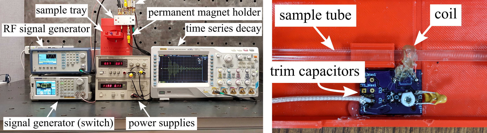
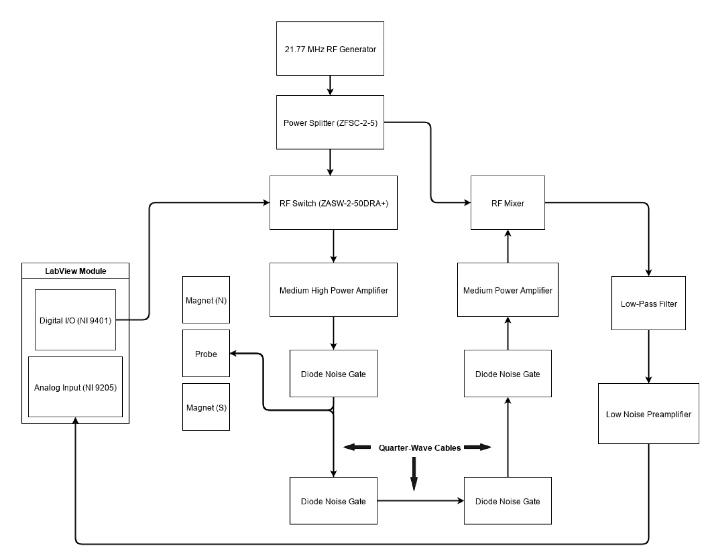

# NMR

A compact nuclear magnetic resonance (NMR) device for: 
* In situ fuel characterization 
* studying coking in thermal management systems
* In situ detection of contaminants in flood waters

