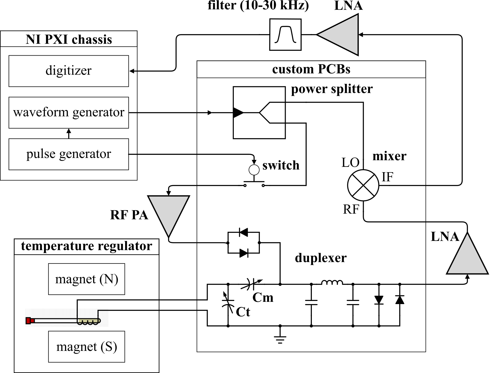
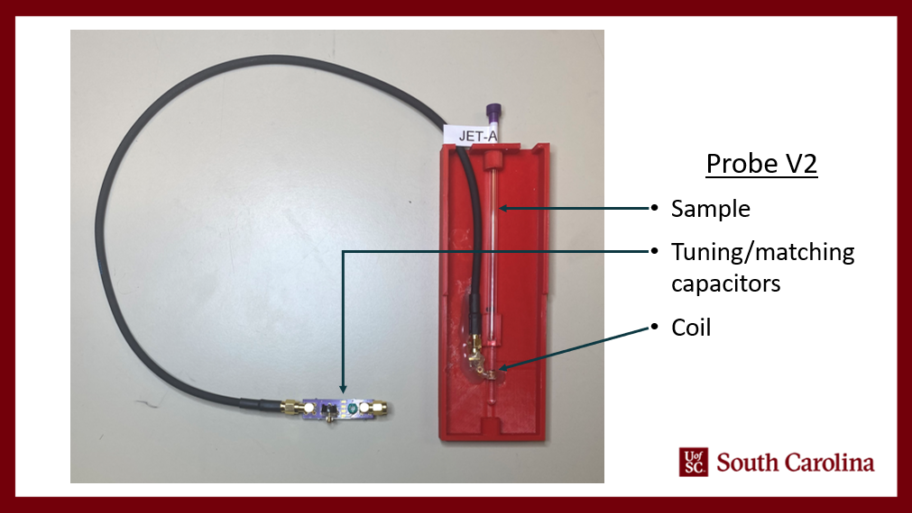

# Compact-NMR (cNMR)

A compact nuclear magnetic resonance (NMR) device for: 
* In situ fuel characterization 
* studying coking in thermal management systems
* In situ detection of contaminants in flood waters
* Magnetic nanoparticle detection in wildfire ash

