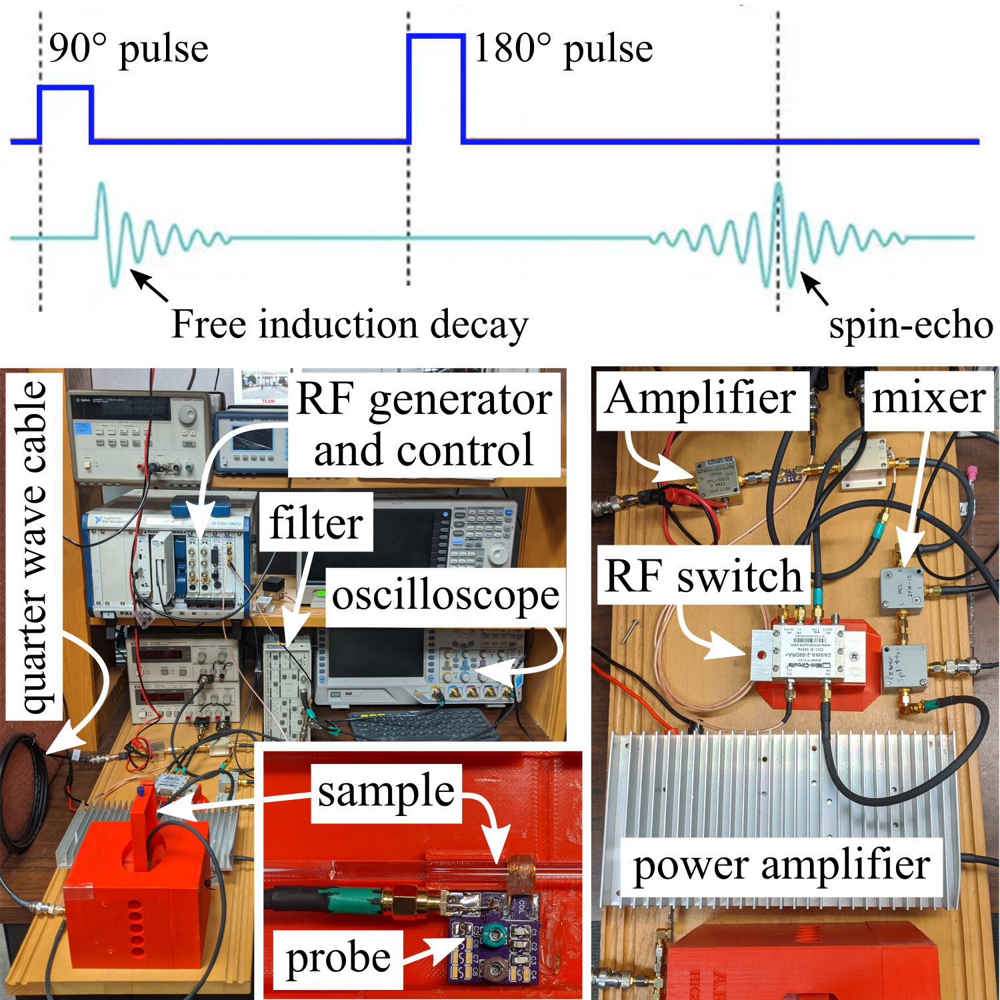
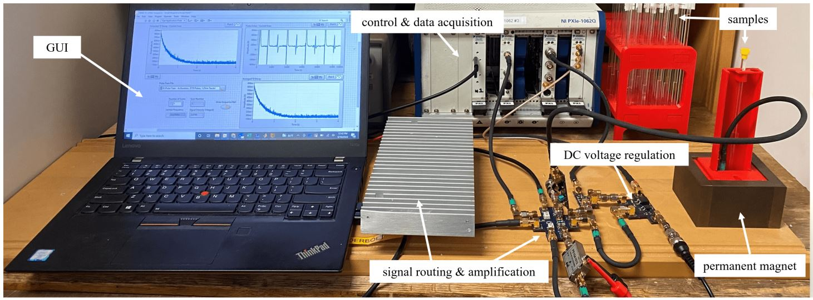
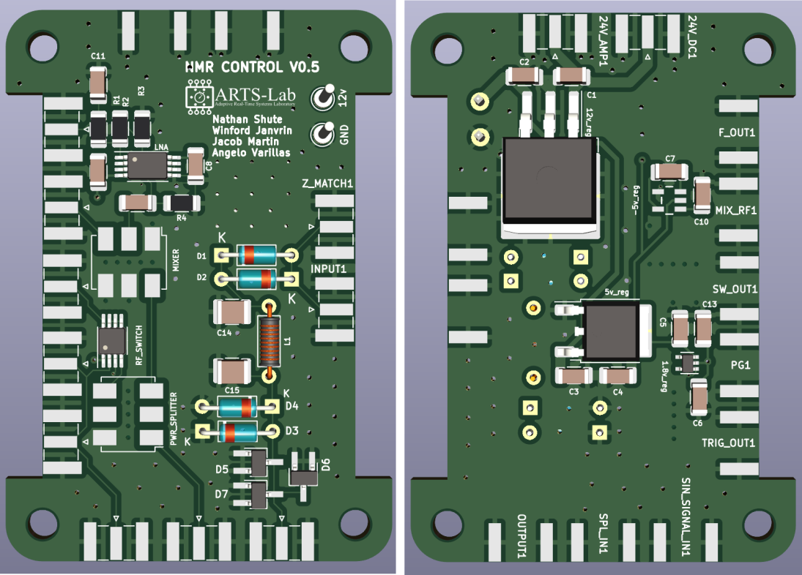

# Compact-NMR (cNMR) - Systems Development 

## Version 0.1 Rabi
* A full-scale development system that uses full-size amplifiers, filters, and switches. 
* A working prototype was developed.  

Figure 1: Full setup for the first version of the TD-NMR system, with key components and subsystems annotated. 

## Version 0.2 - Bloch
* A full-scale development that combines amplifiers, filters, and switches onto custom PCB boards.
* Temperature regulation was added for increased system stability and testing accuracy.

Figure 1: Full setup for the second version of the TD-NMR system, with key components and subsystems annotated. 

## Version 0.3 - Purcell
* A smaller and portable device with reduced power consumption and physical footprint intended for in situ environmental monitoring.
* A new compact magnet was designed and temperature regulation has been removed in favor of a frequency calibration method.

Figure 2: Full setup for the third version of the TD-NMR system, with key components and subsystems annotated. 

## Version 0.4 - Van Hove
* A bigger board that includes duplexer, voltage regulator, and amplifier on one control board.

Figure 3: Full setup for the fourth version of the TD-NMR system, with key components and subsystems annotated. 

## Version 0.5 Dirac
* A small and compact design intended for use in a sensor package design that can be easily deployed and retrieved.

The compact NMR system.

