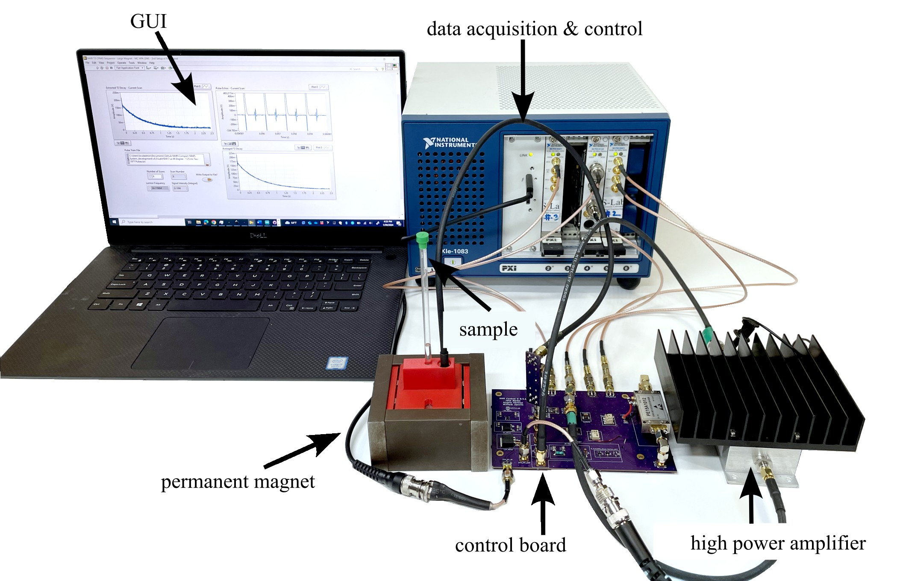
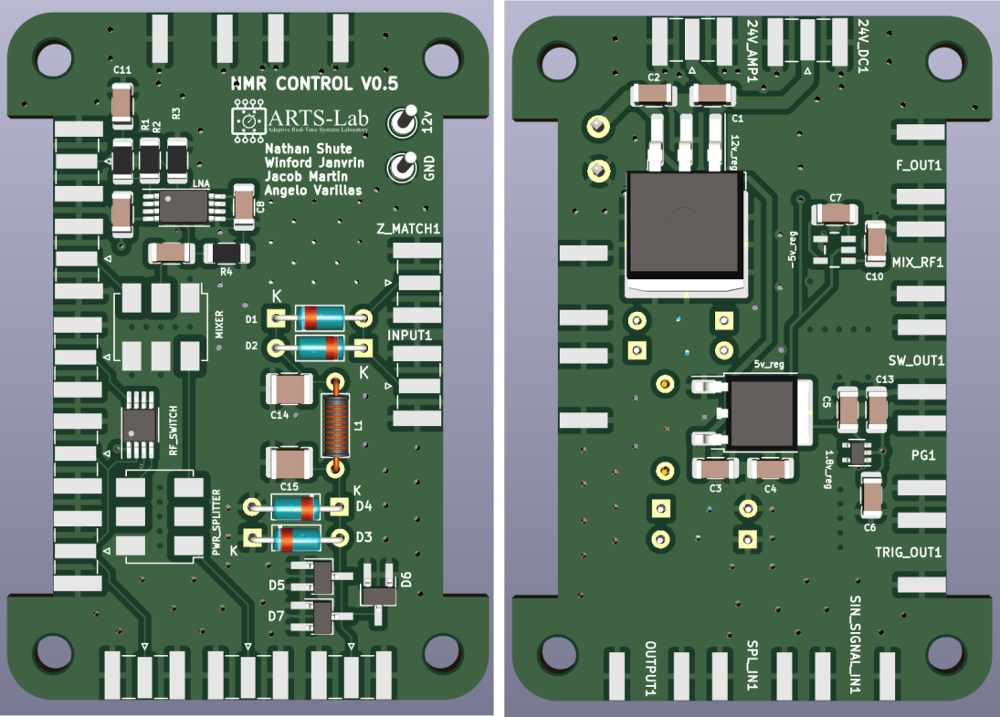

# Compact-NMR (cNMR) - System Development 
Various developed systems, named after physicists who worked on aspects related to NMR.

## Van Hove
* A single control board that includes duplexer, voltage regulator, and amplifier on one control board.

The compact NMR system.

## Dirac
* A small and compact design intended for use in a sensor package design that can be easily deployed and retrieved.

The compact NMR system.

