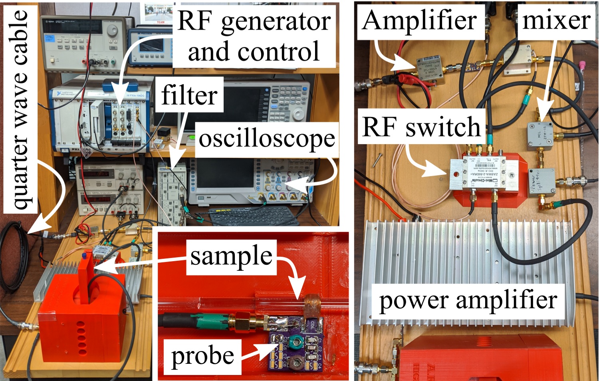

# Compact-NMR (cNMR) - Systems Development 

## Version 0.1 Rabi
* A full-scale development system that uses full-size amplifiers, filters, and switches. 

The compact NMR system.

## Version 0.2 - Bloch
* A full-scale development that combines amplifiers, filters, and switches onto custom PCB boards.

  

The compact NMR system.

## Version 0.3 - Purcell
* A design with temperature regulation removed in favor of a frequency calibration method.

The compact NMR system.

## Version 0.4 - Van Hove
* A single control board that includes duplexer, voltage regulator, and amplifier on one control board.

The compact NMR system.

## Version 0.5 Dirac
* A small and compact design intended for use in a sensor package design that can be easily deployed and retrieved.

The compact NMR system.

