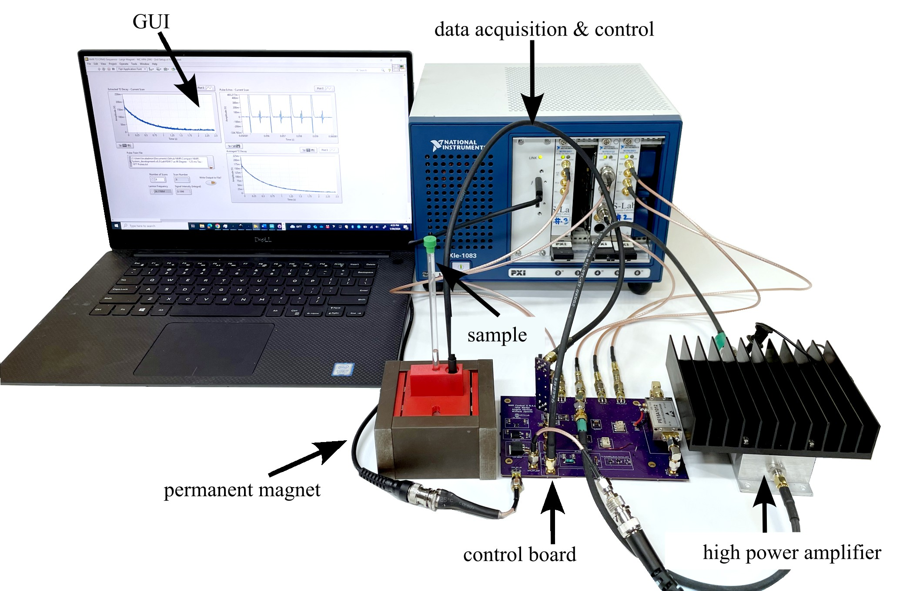

# Compact-NMR (cNMR) - Van Hove

Main aspects of this version are:
* Stable version with all components moved onto one control board that includes duplexer, voltage regulator, and amplifier on one control board.
* A single large PCB measuring approximately 90 x 140 mm.
 

The compact NMR system.

