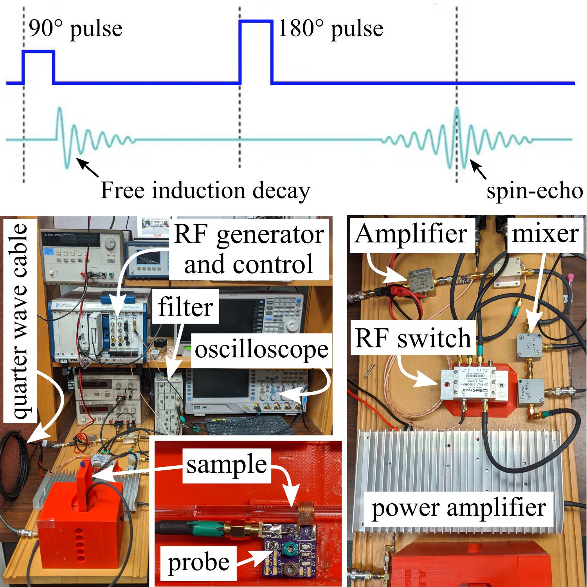
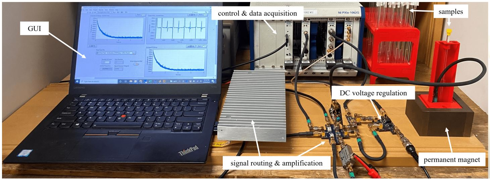

# Deprecated Variations of the Compact-NMR (cNMR) 
Various developed systems, named after physicists who worked on aspects related to NMR.

## Rabi
* A full-scale development system that uses full-size amplifiers, filters, and switches. 

The compact NMR system.

## Bloch
* A full-scale development that combines amplifiers, filters, and switches onto custom PCB boards.

  

The compact NMR system.

## Purcell
* A design with temperature regulation removed in favor of a frequency calibration method.

The compact NMR system.

