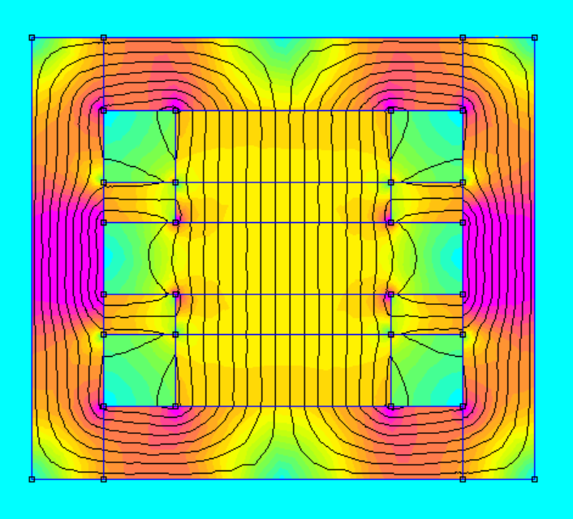

# B645 Tesla Magnet

| Magnet Type | Size                        | Price      | Weight    | Magnetic Field Strength |  
| ----------- | --------------------------- | ---------- | --------- | ----------------------- | 
|      B      |    3.5in x 3.0625in x 2in   |   $182.64  |  70.2 oz  |        1.049 Tesla      | 

## Magnet design, simulation, and product
The permanent magnet assembly uses:
* BX8X88: https://bit.ly/BX8X88Magnets 
* BX844:  https://bit.ly/BX844Magnets 

  

    
    
CAD model of the magnet design

  

  
  

    
    
2D Finite element magneic model and simulation

  

  
  

    
    
Polarization plot of the magnet

  

  

    
    
Assembled magnet

  

