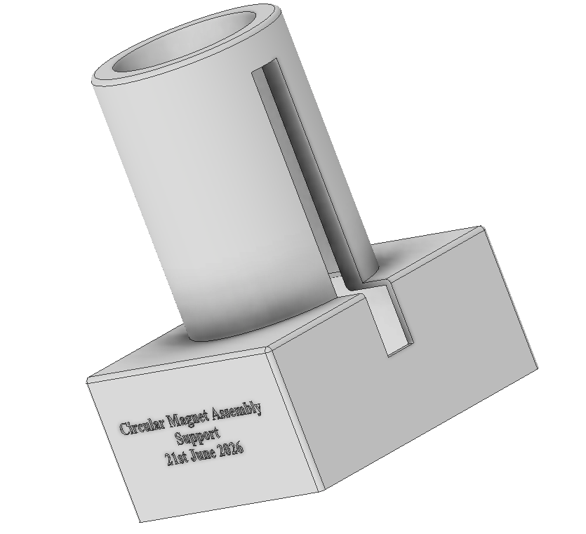

# Magnet Assembly Tools

## 1. Magnet Assembly Tool

**Purpose**
- Used to assemble the magnet assembly.

  <figure>
      
    <figcaption><strong>CAD model:</strong> 3D CAD rendering of the magnet assembly.</figcaption>
  </figure>

   
