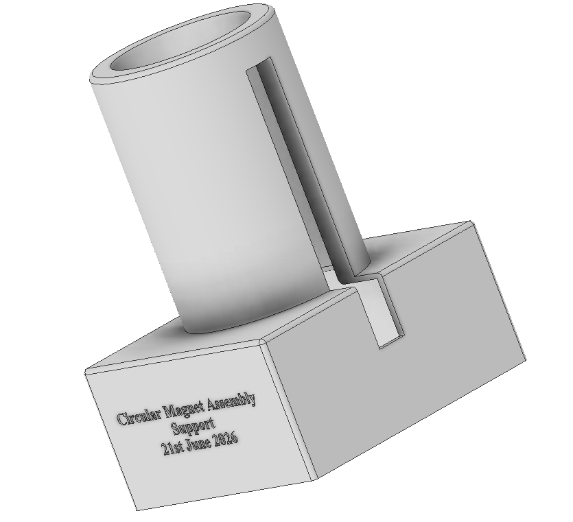
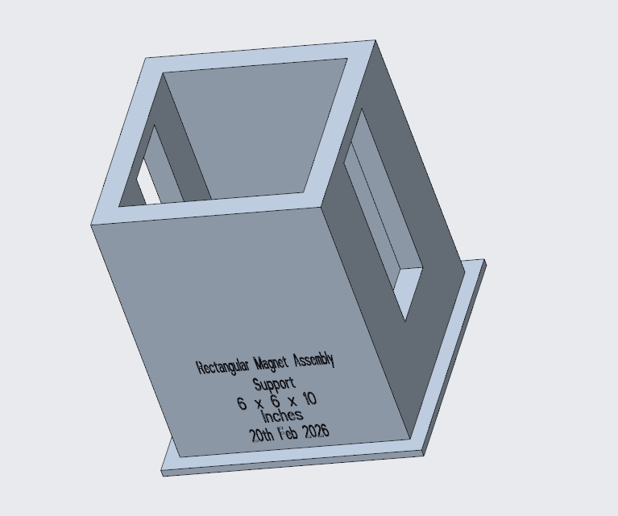
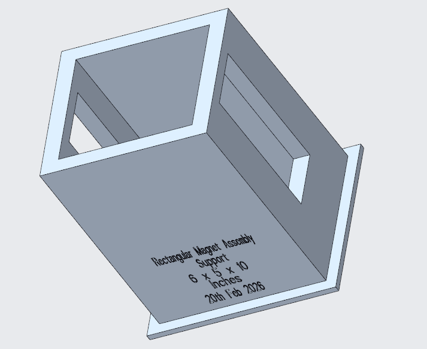

# Magnet Assembly Tools

## 1. Magnet Assembly Tool

**Purpose**
- Used to assemble the magnet assembly.

  <figure>
      
    <figcaption><strong>CAD model:</strong> 3D CAD rendering of the magnet assembly.</figcaption>
  </figure>

   

## 2. Side Plates Assembly Tool

**Purpose**
- Used to assemble the metal bars that goes around the magnet in a symmetric way to confine the magnetic field of the magnet.

  <figure>
      
    <figcaption><strong>CAD model:</strong> 3D CAD rendering of the smaller side plate assembly.</figcaption>
  </figure>

   

  <figure>
      
    <figcaption><strong>CAD model:</strong> 3D CAD rendering of the bigger side plate assembly.</figcaption>
  </figure>

   