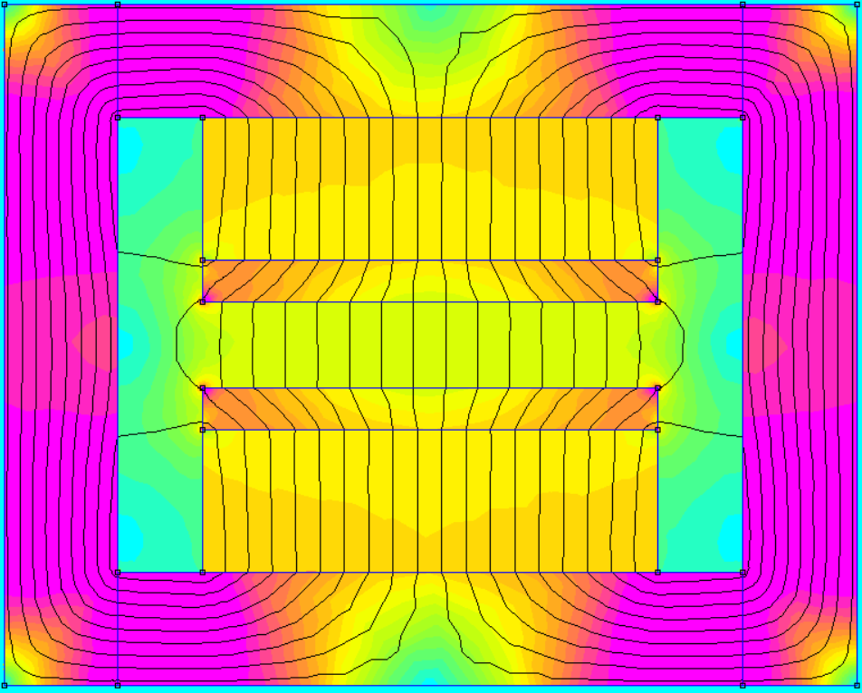
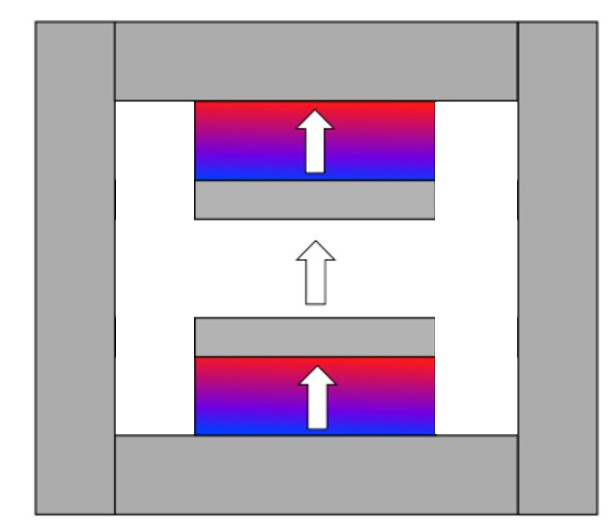

# A650 Tesla Magnet

| Magnet Type | Size                        | Price      | Weight    | Magnetic Field Strength |  
| ----------- | --------------------------- | ---------- | --------- | ----------------------- | 
|      A      | 3 Inch (Diameter) x 1 Inch  |   $207.71  |  56.8 lb. |        0.65 Tesla       | 

## Magnet design, simulation, and product
The permanent magnet assembly uses:
* DZ0X0-N42: https://www.kjmagnetics.com/dz0x0-neodymium-disc-magnet

  <figure>
      
    <figcaption><strong>CAD model:</strong> 3D CAD rendering of the permanent magnet assembly.</figcaption>
  </figure>

   

  <figure>
      
    <figcaption><strong>Finite element simulation:</strong> 2D magnetic field model used to evaluate the magnet assembly design.</figcaption>
  </figure>

   

  <figure>
      
    <figcaption><strong>Polarization plot:</strong> Magnet polarization layout showing the orientation of the magnetic elements.</figcaption>
  </figure>

   

  <figure>
      
    <figcaption><strong>Prototype:</strong> Assembled physical magnet prototype.</figcaption>
  </figure>

   

  <figure>
      
    <figcaption><strong>Magnetic field map:</strong> Measured magnetic field distribution across the magnet region.</figcaption>
  </figure>

   
  
  <figure>
      
    <figcaption><strong>Vertical assembly:</strong> Full vertical case, magnet, and tray assembly.</figcaption>
  </figure>

   

  <figure>
      
    <figcaption><strong>Horizontal assembly:</strong> Full horizontal case, magnet, and tray assembly.</figcaption>
  </figure>

