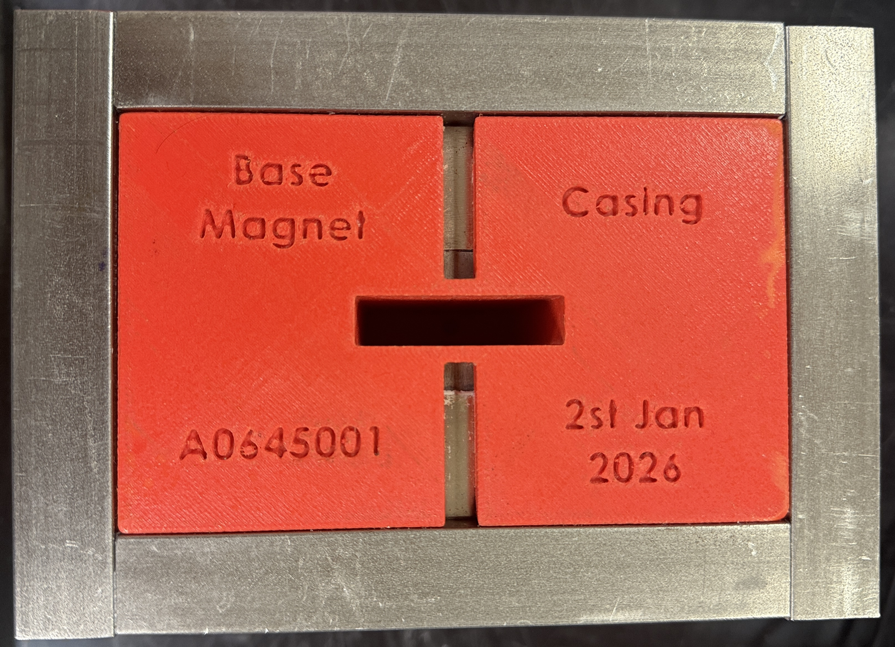
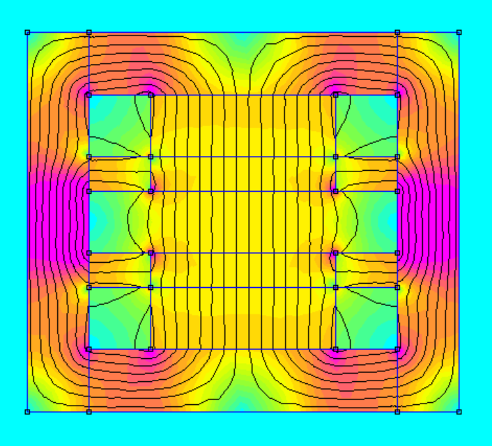

# A645 Tesla Magnet

| Magnet Type | Size                        | Price      | Weight    | Magnetic Field Strength |  
| ----------- | --------------------------- | ---------- | --------- | ----------------------- | 
|      A      | 3 Inch (Diameter) x 1 Inch  |   $207.71  |  30.7 oz  |        0.65 Tesla       | 

## Magnet design, simulation, and product

  

    
    
Assembled magnet

  

  
  

    
    
2D Finite element magneic model and simulation

  
