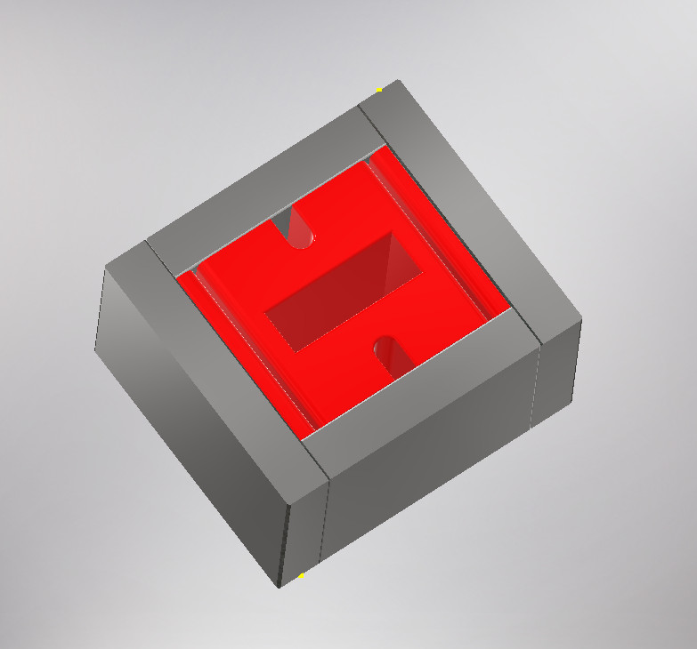
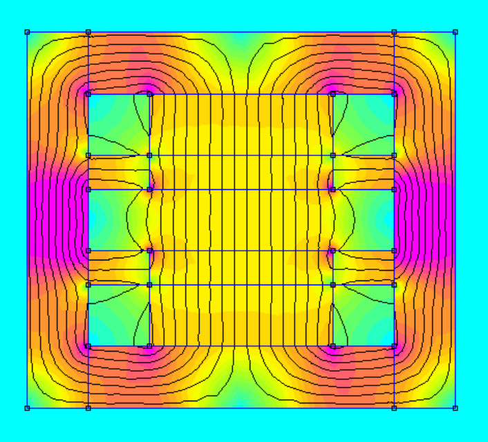
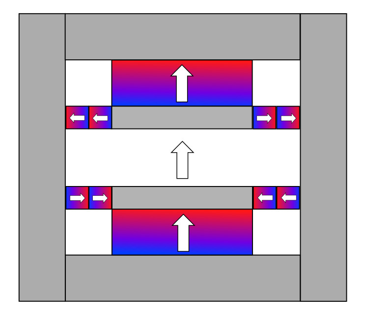
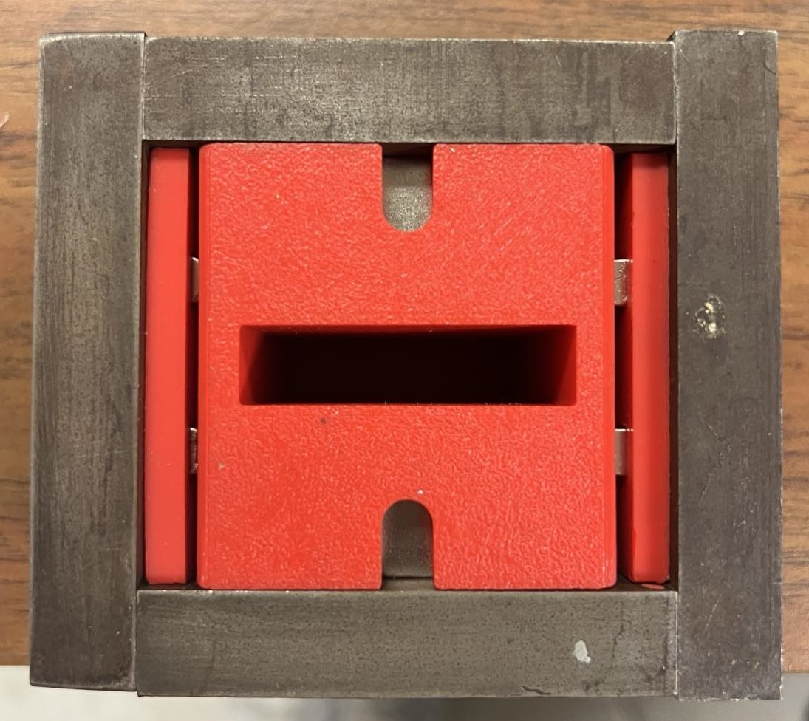
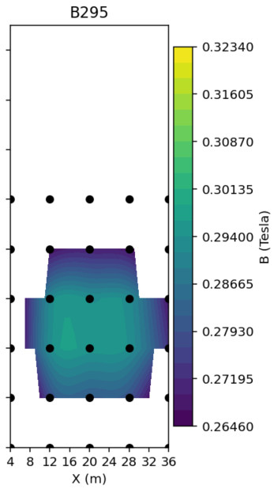

# B645 Tesla Magnet

| Magnet Type | Size                        | Price      | Weight    | Magnetic Field Strength |  
| ----------- | --------------------------- | ---------- | --------- | ----------------------- | 
|      B      |    3.5in x 3.0625in x 2in   |   $182.64  |  70.2 oz  |        1.049 Tesla      | 

## Magnet design, simulation, and product
The permanent magnet assembly uses:
* BX8X88: https://bit.ly/BX8X88Magnets 
* BX844:  https://bit.ly/BX844Magnets 

  <figure>
    
    <figcaption><strong>CAD model:</strong> 3D CAD rendering of the permanent magnet assembly.</figcaption>
  </figure>

   

  <figure>
    
    <figcaption><strong>Finite element simulation:</strong> 2D magnetic field model used to evaluate the magnet assembly design.</figcaption>
  </figure>

   

  <figure>
    
    <figcaption><strong>Polarization plot:</strong> Magnet polarization layout showing the orientation of the magnetic elements.</figcaption>
  </figure>

   

  <figure>
    
    <figcaption><strong>Prototype:</strong> Assembled physical magnet prototype.</figcaption>
  </figure>

   

  <figure>
    
    <figcaption><strong>Magnetic field map:</strong> Measured magnetic field distribution across the magnet region.</figcaption>
  </figure>

