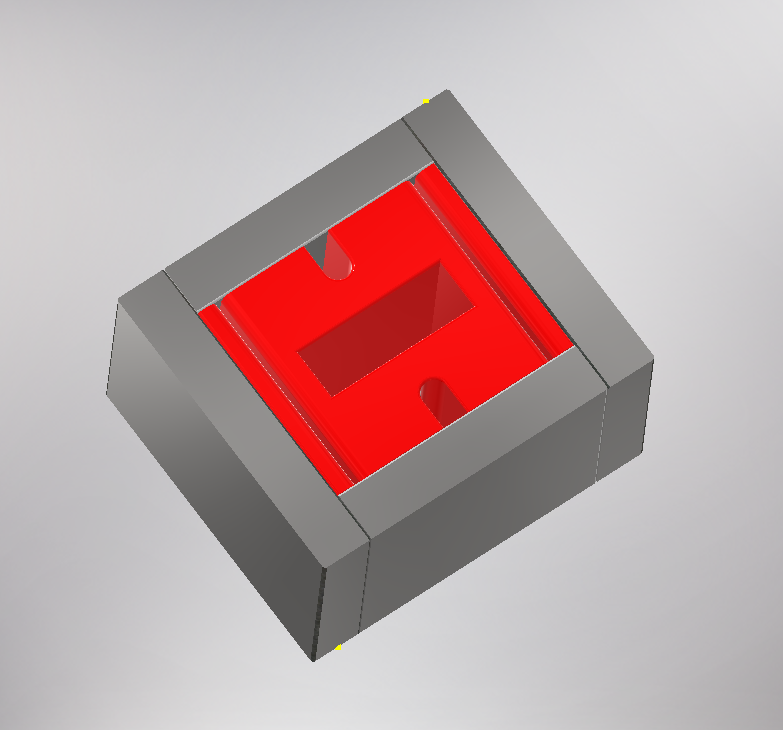

# B645 Tesla Magnet

| Magnet Type | Size                        | Price      | Weight    | Magnetic Field Strength |  
| ----------- | --------------------------- | ---------- | --------- | ----------------------- | 
|      B      |    3.5in x 3.0625in x 2in   |   $182.64  |  70.2 oz  |      0.8146 Tesla       | 

## Magnet design, simulation, and product
The permanent magnet assembly uses:
* BX8X88: https://bit.ly/BX8X88Magnets |
* BX844:  https://bit.ly/BX844Magnets 

  

    
    
B645 NMR Magnet: CAD Model

  

CAD model of the magnet design
  
  

    
    
B645 NMR Magnet: FEMM Simulation

  

2D finite element magneic model
  
  

    
    
B645 NMR Magnet: Polarization Plot

  

Polarization plot of the magnet

  

    
    
B645 NMR Magnet: Prototype

  

Assembled magnet
  
